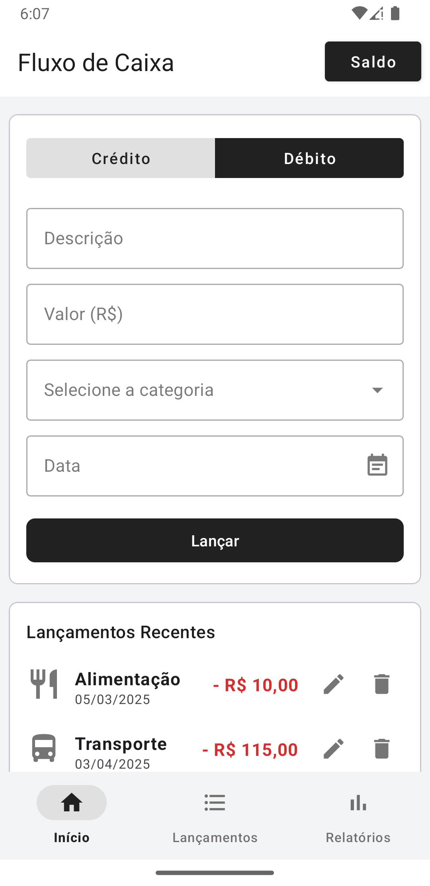
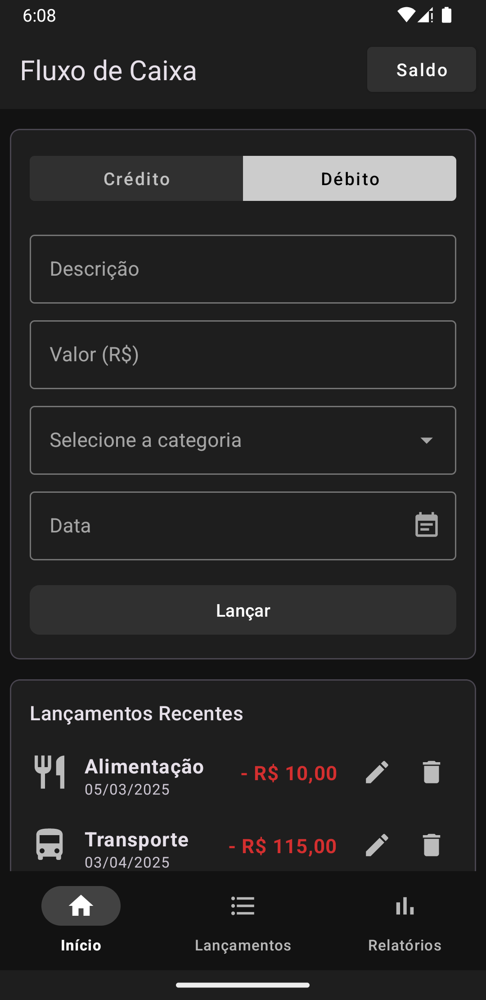
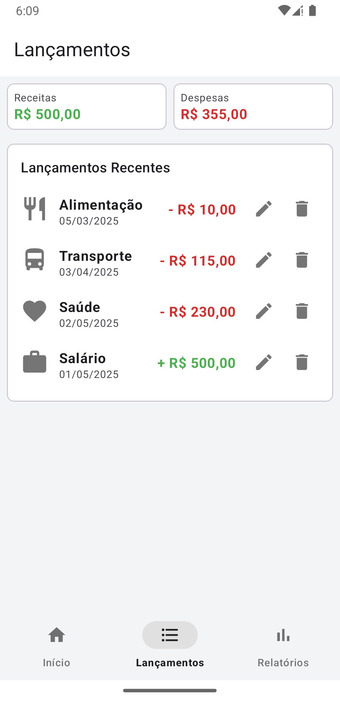
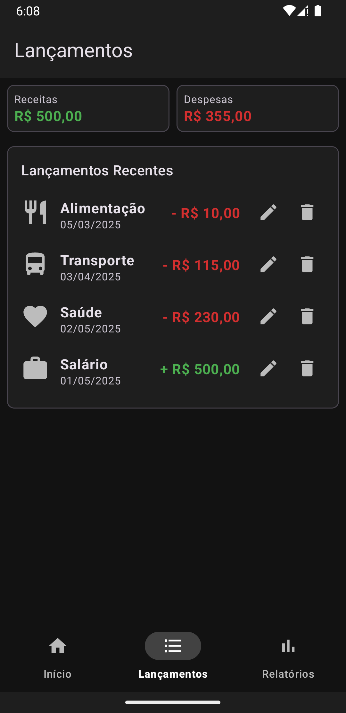
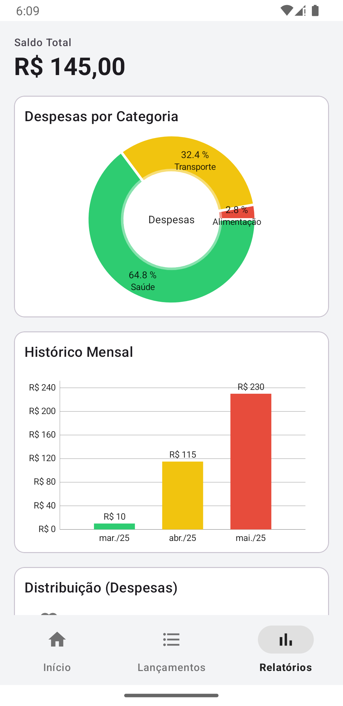
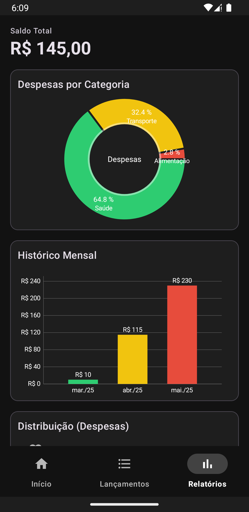

# App Fluxo de Caixa Pessoal (Android Nativo - Kotlin)

## 📝 Descrição

Aplicativo Android nativo para gerenciamento de fluxo de caixa pessoal, desenvolvido como projeto final para a disciplina de Android Aplicado na Pós-Graduação em Especialização em Dispositivos Móveis na Universidade Tecnológica Federal do Paraná.

O objetivo é permitir ao usuário registrar, visualizar, editar e excluir suas receitas (Créditos) e despesas (Débitos), além de consultar o saldo e obter relatórios visuais sobre suas finanças.

## ✨ Funcionalidades Principais

* **Lançamento de Transações:** Registro de créditos e débitos com descrição, valor, categoria (Salário, Extras, Alimentação, Transporte, Saúde, Moradia) e data (usando MaterialDatePicker).
* **Listagem e Extrato:** Visualização da lista completa de transações na tela "Lançamentos".
* **Edição e Exclusão:** Funcionalidades completas de CRUD (Criar, Ler, Atualizar, Deletar) para as transações.
* **Tela Inicial Combinada:** Apresenta os campos para novo lançamento e uma lista das transações mais recentes.
* **Relatórios Visuais:**
    * Exibição do Saldo Total atual.
    * Gráfico de Pizza (Pie Chart) mostrando a distribuição de despesas por categoria.
    * Gráfico de Barras (Bar Chart) exibindo o histórico mensal de despesas (ou receitas/saldo).
    * Lista com o total gasto por categoria.
* **Persistência Local:** Armazenamento seguro dos dados em um banco de dados SQLite gerenciado pela biblioteca Room.
* **Navegação Moderna:** Uso do Navigation Component e BottomNavigationView para navegação entre as telas principais (Início, Lançamentos, Relatórios).
* **Interface Responsiva:** Adaptação a diferentes tamanhos de tela e orientações.
* **Tema Dinâmico:** Suporte completo aos modos Claro (Light) e Escuro (Dark) do Android, seguindo as diretrizes do Material Design.

## 📸 Screenshots

**(Instrução: Crie uma pasta chamada `screenshots` na raiz do seu projeto e coloque as imagens lá. Substitua os caminhos abaixo se necessário e coloque uma breve descrição no Alt text `[]`)**

| Modo Claro                                        | Modo Escuro                                        |
| :------------------------------------------------: | :------------------------------------------------: |
|  |  |
| *Tela Inicial/Lançamento* | *Tela Inicial/Lançamento* |
|  |  |
| *Tela de Extrato/Lista* | *Tela de Extrato/Lista* |
|  |  |
| *Tela de Relatórios/Gráficos* | *Tela de Relatórios/Gráficos* |

## 🛠️ Tecnologias Utilizadas

* **Linguagem:** [Kotlin](https://kotlinlang.org/)
* **Arquitetura:** MVVM (Model-View-ViewModel)
* **Android Jetpack:**
    * [View Binding](https://developer.android.com/topic/libraries/view-binding) / [Data Binding](https://developer.android.com/topic/libraries/data-binding) (Escolha qual usou)
    * [ViewModel](https://developer.android.com/topic/libraries/architecture/viewmodel)
    * [LiveData](https://developer.android.com/topic/libraries/architecture/livedata)
    * [Room Persistence Library](https://developer.android.com/training/data-storage/room) (SQLite ORM)
    * [Navigation Component](https://developer.android.com/guide/navigation) (com Safe Args)
    * [Fragment KTX](https://developer.android.com/kotlin/ktx#fragment)
    * [Lifecycle](https://developer.android.com/topic/libraries/architecture/lifecycle)
* **Interface Gráfica (UI):**
    * [Material Design Components](https://material.io/develop/android/docs/getting-started) (MaterialCardView, MaterialButton, TextInputLayout, BottomNavigationView, MaterialDatePicker, etc.)
    * [RecyclerView](https://developer.android.com/guide/topics/ui/layout/recyclerview)
    * [MPAndroidChart](https://github.com/PhilJay/MPAndroidChart) (Ou outra biblioteca de gráficos que você usou)
* **IDE:** Android Studio Meerkat
* **Build:** Gradle

## ⚙️ Configuração e Instalação (Opcional)

1.  Clone o repositório: `git clone https://github.com/luispaganini/av2-fluxo-caixa-kotlin.git`
2.  Abra o projeto no Android Studio.
3.  Aguarde o Gradle sincronizar as dependências.
4.  Compile e execute em um emulador ou dispositivo físico (API 28 ou superior).

## 👨‍💻 Autor

* **Luis Fernando Paganini**
* **LinkedIn:** https://www.linkedin.com/in/luispaganini/
* **GitHub:** https://github.com/luispaganini

---